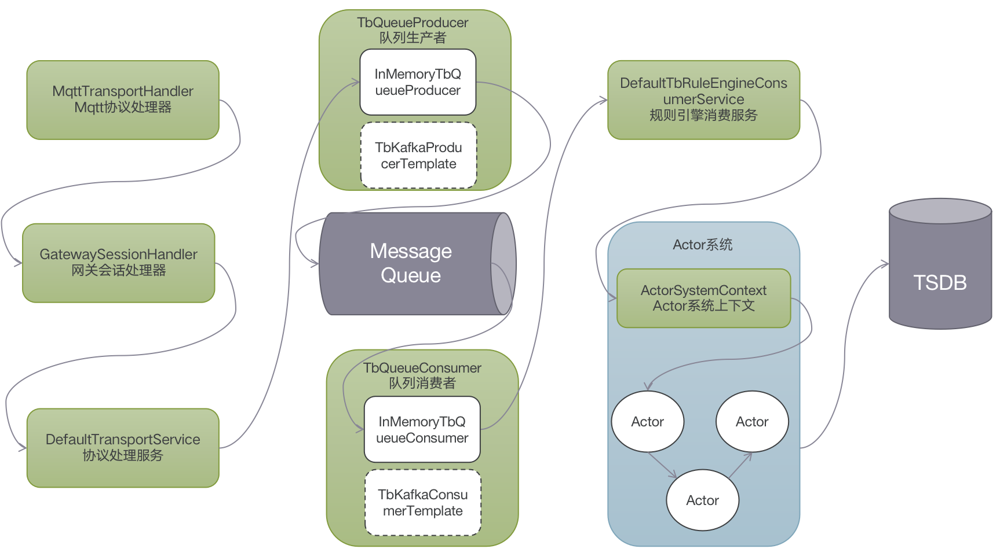

#### 	环境准备
- release-3.2分支源码

#### 描述
以MQTT协议接入为例，分析设备如何传输数据到Thingsboard。在一般情况下（服务质量等级Qos为0，不保证消息一定到达），使用Mqtt客户端向云端发送PUBLISH消息即可完成传输，不用处理PUBACK


#### 分析

与设备连接类似，入口类：`MqttTransportService`，核心处理类为`MqttTransportHandler`

#### 数据传输
##### 普通设备
在MqttTransportHandler中进行Mqtt消息处理，以一个的普通设备上传数据`{"temp":31.23}`为例，核心处理流程如下：
```
//MqttTransportHandler 132
processMqttMsg(ctx, (MqttMessage) msg);

//MqttTransportHandler 158
processRegularSessionMsg(ctx, msg);

//MqttTransportHandler 207
processPublish(ctx, (MqttPublishMessage) msg);

//MqttTransportHandler 245
//调用processDevicePublish方法处理设备消息 
processDevicePublish(ctx, mqttMsg, topicName, msgId);

//MqttTransportHandler 288
//转换为遥测消息，调用transportService进行处理
TransportProtos.PostTelemetryMsg postTelemetryMsg = payloadAdaptor.convertToPostTelemetry(deviceSessionCtx, mqttMsg);
transportService.process(deviceSessionCtx.getSessionInfo(), postTelemetryMsg, getPubAckCallback(ctx, msgId, postTelemetryMsg));

//DefaultTransportService 382
//调用sendToRuleEngine方法处理消息
sendToRuleEngine(tenantId, deviceId, sessionInfo, json, metaData, SessionMsgType.POST_TELEMETRY_REQUEST, packCallback);

//DefaultTransportService 797
//转换消息类型为TbMsg，调用sendToRuleEngine方法处理消息
TbMsg tbMsg = TbMsg.newMsg(queueName, sessionMsgType.name(), deviceId, metaData, gson.toJson(json), ruleChainId, null);
sendToRuleEngine(tenantId, tbMsg, callback);

//DefaultTransportService 776
//调用ruleEngineMsgProducer（类型为TbQueueProducer）发送消息
//TbQueueProducer有多种实现，常见的是InMemoryTbQueueProducer和TbKafkaProducerTemplate
ruleEngineMsgProducer.send(tpi, new TbProtoQueueMsg<>(tbMsg.getId(), msg), wrappedCallback);

//MqttTransportHandler 324
//调用ack方法准备ack消息
ack(ctx, msgId);

//MqttTransportHandler 315
//channel上下文中写入并刷新PUBACK消息。
ctx.writeAndFlush(createMqttPubAckMsg(msgId));

//DefaultTbRuleEngineConsumerService 165
List<TbProtoQueueMsg<ToRuleEngineMsg>> msgs = consumer.poll(pollDuration);

//DefaultTbRuleEngineConsumerService 185
forwardToRuleEngineActor(configuration.getName(), tenantId, toRuleEngineMsg, callback);

//DefaultTbRuleEngineConsumerService 300
msg = new QueueToRuleEngineMsg(tenantId, tbMsg, relationTypes, toRuleEngineMsg.getFailureMessage());
actorContext.tell(msg);
```
示意图如下：


##### 网关
以一个的网关上传设备数据`{{"设备1":[{"temp":18}]}`为例，核心处理流程如下：
```
//MqttTransportHandler 132 同普通设备

//MqttTransportHandler 158 同普通设备

//MqttTransportHandler 207 同普通设备

//MqttTransportHandler 241
handleGatewayPublishMsg(ctx, topicName, msgId, mqttMsg);

//MqttTransportHandler 253
gatewaySessionHandler.onDeviceTelemetry(mqttMsg);

//GatewaySessionHandler 122
onDeviceTelemetryJson(msgId, payload);

//GatewaySessionHandler 346
TransportProtos.PostTelemetryMsg postTelemetryMsg = JsonConverter.convertToTelemetryProto(deviceEntry.getValue().getAsJsonArray());
processPostTelemetryMsg(deviceCtx, postTelemetryMsg, deviceName, msgId);

//GatewaySessionHandler 400
transportService.process(deviceCtx.getSessionInfo(), postTelemetryMsg, getPubAckCallback(channel, deviceName, msgId, postTelemetryMsg));

//DefaultTransportService 382 同普通设备

//DefaultTransportService 797 同普通设备

//DefaultTransportService 776 同普通设备

//GatewaySessionHandler 726
ctx.writeAndFlush(MqttTransportHandler.createMqttPubAckMsg(msgId))

//DefaultTbRuleEngineConsumerService 165 同普通设备

//DefaultTbRuleEngineConsumerService 185 同普通设备

//DefaultTbRuleEngineConsumerService 300 同普通设备
```
示意图如下：



#### TIPS

- 网关的实体类型也是设备，通过附加信息`additional_info`属性`gateway`为`true`来标记设备为网关。

- TOPIC信息：请求TOPIC：`tb_rule_engine`，可配置`TB_QUEUE_RULE_ENGINE_TOPIC`进行修改。

## mqtt 设备上报 telemetry

```
mosquitto_pub -d -q 1 -h 127.0.0.1  -t "v1/devices/me/telemetry" -u "$ACCESS_TOKEN"  -m '{"temperature":42}'
```

### 生产消息

```
sendToRuleEngine:999, DefaultTransportService (org.thingsboard.server.common.transport.service)
sendToRuleEngine:1021, DefaultTransportService (org.thingsboard.server.common.transport.service)
process:506, DefaultTransportService (org.thingsboard.server.common.transport.service)
processDevicePublish:319, MqttTransportHandler (org.thingsboard.server.transport.mqtt)
processPublish:268, MqttTransportHandler (org.thingsboard.server.transport.mqtt)
processRegularSessionMsg:228, MqttTransportHandler (org.thingsboard.server.transport.mqtt)
processMqttMsg:179, MqttTransportHandler (org.thingsboard.server.transport.mqtt)
channelRead:153, MqttTransportHandler (org.thingsboard.server.transport.mqtt)
invokeChannelRead:379, AbstractChannelHandlerContext (io.netty.channel)
invokeChannelRead:365, AbstractChannelHandlerContext (io.netty.channel)
fireChannelRead:357, AbstractChannelHandlerContext (io.netty.channel)
fireChannelRead:324, ByteToMessageDecoder (io.netty.handler.codec)
channelRead:296, ByteToMessageDecoder (io.netty.handler.codec)
invokeChannelRead:379, AbstractChannelHandlerContext (io.netty.channel)
invokeChannelRead:365, AbstractChannelHandlerContext (io.netty.channel)
fireChannelRead:357, AbstractChannelHandlerContext (io.netty.channel)
channelRead:1410, DefaultChannelPipeline$HeadContext (io.netty.channel)
invokeChannelRead:379, AbstractChannelHandlerContext (io.netty.channel)
invokeChannelRead:365, AbstractChannelHandlerContext (io.netty.channel)
fireChannelRead:919, DefaultChannelPipeline (io.netty.channel)
read:166, AbstractNioByteChannel$NioByteUnsafe (io.netty.channel.nio)
processSelectedKey:719, NioEventLoop (io.netty.channel.nio)
processSelectedKeysOptimized:655, NioEventLoop (io.netty.channel.nio)
processSelectedKeys:581, NioEventLoop (io.netty.channel.nio)
run:493, NioEventLoop (io.netty.channel.nio)
run:989, SingleThreadEventExecutor$4 (io.netty.util.concurrent)
run:74, ThreadExecutorMap$2 (io.netty.util.internal)
run:30, FastThreadLocalRunnable (io.netty.util.concurrent)
run:829, Thread (java.lang)
```

### 消费消息

```
onMsg:75, TbMsgTimeseriesNode (org.thingsboard.rule.engine.telemetry)
onRuleChainToRuleNodeMsg:135, RuleNodeActorMessageProcessor (org.thingsboard.server.actors.ruleChain)
onRuleChainToRuleNodeMsg:95, RuleNodeActor (org.thingsboard.server.actors.ruleChain)
doProcess:61, RuleNodeActor (org.thingsboard.server.actors.ruleChain)
process:45, ContextAwareActor (org.thingsboard.server.actors.service)
processMailbox:141, TbActorMailbox (org.thingsboard.server.actors)
run:-1, 277866737 (org.thingsboard.server.actors.TbActorMailbox$$Lambda$1548)
exec:1426, ForkJoinTask$RunnableExecuteAction (java.util.concurrent)
doExec$$$capture:290, ForkJoinTask (java.util.concurrent)
doExec:-1, ForkJoinTask (java.util.concurrent)
topLevelExec:1020, ForkJoinPool$WorkQueue (java.util.concurrent)
scan:1656, ForkJoinPool (java.util.concurrent)
runWorker:1594, ForkJoinPool (java.util.concurrent)
run:183, ForkJoinWorkerThread (java.util.concurrent)
```

### 规则引擎消费任务

```
tryProcessQueue:119, TbActorMailbox (org.thingsboard.server.actors)
enqueue:97, TbActorMailbox (org.thingsboard.server.actors)
tell:229, TbActorMailbox (org.thingsboard.server.actors)
tell:600, ActorSystemContext (org.thingsboard.server.actors)
forwardToRuleEngineActor:401, DefaultTbRuleEngineConsumerService (org.thingsboard.server.service.queue)
submitMessage:329, DefaultTbRuleEngineConsumerService (org.thingsboard.server.service.queue)
lambda$consumerLoop$9:260, DefaultTbRuleEngineConsumerService (org.thingsboard.server.service.queue)
run:-1, 1480992612 (org.thingsboard.server.service.queue.DefaultTbRuleEngineConsumerService$$Lambda$1746)
call:515, Executors$RunnableAdapter (java.util.concurrent)
run$$$capture:264, FutureTask (java.util.concurrent)
run:-1, FutureTask (java.util.concurrent)
 - Async stack trace
<init>:151, FutureTask (java.util.concurrent)
newTaskFor:93, AbstractExecutorService (java.util.concurrent)
submit:117, AbstractExecutorService (java.util.concurrent)
submit:714, Executors$DelegatedExecutorService (java.util.concurrent)
lambda$consumerLoop$10:260, DefaultTbRuleEngineConsumerService (org.thingsboard.server.service.queue)
lambda$submitAttempt$0:37, BurstTbRuleEngineSubmitStrategy (org.thingsboard.server.service.queue.processing)
forEach:1541, ArrayList (java.util)
submitAttempt:37, BurstTbRuleEngineSubmitStrategy (org.thingsboard.server.service.queue.processing)
consumerLoop:260, DefaultTbRuleEngineConsumerService (org.thingsboard.server.service.queue)
lambda$launchConsumer$8:244, DefaultTbRuleEngineConsumerService (org.thingsboard.server.service.queue)
runWorker:1128, ThreadPoolExecutor (java.util.concurrent)
run:628, ThreadPoolExecutor$Worker (java.util.concurrent)
run:829, Thread (java.lang)
```

规则引擎消息任务从队列消费消息，最终调用 TbMsgTimeseriesNode.onMsg 处理 JSON，写 TSDB。

### 写 TSDB

```
getSaveLatestFuture:283, SqlTimeseriesLatestDao (org.thingsboard.server.dao.sqlts)
saveLatest:146, SqlTimeseriesLatestDao (org.thingsboard.server.dao.sqlts)
saveAndRegisterFutures:174, BaseTimeseriesService (org.thingsboard.server.dao.timeseries)
save:152, BaseTimeseriesService (org.thingsboard.server.dao.timeseries)
saveAndNotifyInternal:150, DefaultTelemetrySubscriptionService (org.thingsboard.server.service.telemetry)
saveAndNotify:124, DefaultTelemetrySubscriptionService (org.thingsboard.server.service.telemetry)
onMsg:97, TbMsgTimeseriesNode (org.thingsboard.rule.engine.telemetry)
onRuleChainToRuleNodeMsg:135, RuleNodeActorMessageProcessor (org.thingsboard.server.actors.ruleChain)
onRuleChainToRuleNodeMsg:95, RuleNodeActor (org.thingsboard.server.actors.ruleChain)
doProcess:61, RuleNodeActor (org.thingsboard.server.actors.ruleChain)
process:45, ContextAwareActor (org.thingsboard.server.actors.service)
processMailbox:141, TbActorMailbox (org.thingsboard.server.actors)
run:-1, 995185004 (org.thingsboard.server.actors.TbActorMailbox$$Lambda$1553)
exec:1426, ForkJoinTask$RunnableExecuteAction (java.util.concurrent)
doExec$$$capture:290, ForkJoinTask (java.util.concurrent)
doExec:-1, ForkJoinTask (java.util.concurrent)
topLevelExec:1020, ForkJoinPool$WorkQueue (java.util.concurrent)
scan:1656, ForkJoinPool (java.util.concurrent)
runWorker:1594, ForkJoinPool (java.util.concurrent)
run:183, ForkJoinWorkerThread (java.util.concurrent)
```

### TSDB DAO

上面写 TSDB 最终是把写请求放到一个队列，实际由队列的消费者把数据写到 TSDB

```
saveOrUpdate:57, PsqlLatestInsertTsRepository (org.thingsboard.server.dao.sqlts.insert.latest.psql)
invoke:-1, PsqlLatestInsertTsRepository$$FastClassBySpringCGLIB$$d5992c74 (org.thingsboard.server.dao.sqlts.insert.latest.psql)
invoke:218, MethodProxy (org.springframework.cglib.proxy)
invokeJoinpoint:771, CglibAopProxy$CglibMethodInvocation (org.springframework.aop.framework)
proceed:163, ReflectiveMethodInvocation (org.springframework.aop.framework)
proceed:749, CglibAopProxy$CglibMethodInvocation (org.springframework.aop.framework)
invoke:139, PersistenceExceptionTranslationInterceptor (org.springframework.dao.support)
proceed:186, ReflectiveMethodInvocation (org.springframework.aop.framework)
proceed:749, CglibAopProxy$CglibMethodInvocation (org.springframework.aop.framework)
proceedWithInvocation:-1, 1659636071 (org.springframework.transaction.interceptor.TransactionInterceptor$$Lambda$1082)
invokeWithinTransaction:367, TransactionAspectSupport (org.springframework.transaction.interceptor)
invoke:118, TransactionInterceptor (org.springframework.transaction.interceptor)
proceed:186, ReflectiveMethodInvocation (org.springframework.aop.framework)
proceed:749, CglibAopProxy$CglibMethodInvocation (org.springframework.aop.framework)
intercept:691, CglibAopProxy$DynamicAdvisedInterceptor (org.springframework.aop.framework)
saveOrUpdate:-1, PsqlLatestInsertTsRepository$$EnhancerBySpringCGLIB$$98cd1f82 (org.thingsboard.server.dao.sqlts.insert.latest.psql)
lambda$init$3:133, SqlTimeseriesLatestDao (org.thingsboard.server.dao.sqlts)
accept:-1, 1426749677 (org.thingsboard.server.dao.sqlts.SqlTimeseriesLatestDao$$Lambda$912)
lambda$init$2:71, TbSqlBlockingQueue (org.thingsboard.server.dao.sql)
run:-1, 2034639977 (org.thingsboard.server.dao.sql.TbSqlBlockingQueue$$Lambda$907)
call:515, Executors$RunnableAdapter (java.util.concurrent)
run$$$capture:264, FutureTask (java.util.concurrent)
run:-1, FutureTask (java.util.concurrent)
 - Async stack trace
<init>:151, FutureTask (java.util.concurrent)
newTaskFor:93, AbstractExecutorService (java.util.concurrent)
submit:117, AbstractExecutorService (java.util.concurrent)
submit:714, Executors$DelegatedExecutorService (java.util.concurrent)
init:53, TbSqlBlockingQueue (org.thingsboard.server.dao.sql)
init:53, TbSqlBlockingQueueWrapper (org.thingsboard.server.dao.sql)
init:122, SqlTimeseriesLatestDao (org.thingsboard.server.dao.sqlts)
invoke0:-2, NativeMethodAccessorImpl (jdk.internal.reflect)
invoke:62, NativeMethodAccessorImpl (jdk.internal.reflect)
invoke:43, DelegatingMethodAccessorImpl (jdk.internal.reflect)
invoke:566, Method (java.lang.reflect)
invoke:389, InitDestroyAnnotationBeanPostProcessor$LifecycleElement (org.springframework.beans.factory.annotation)
invokeInitMethods:333, InitDestroyAnnotationBeanPostProcessor$LifecycleMetadata (org.springframework.beans.factory.annotation)
postProcessBeforeInitialization:157, InitDestroyAnnotationBeanPostProcessor (org.springframework.beans.factory.annotation)
applyBeanPostProcessorsBeforeInitialization:415, AbstractAutowireCapableBeanFactory (org.springframework.beans.factory.support)
initializeBean:1786, AbstractAutowireCapableBeanFactory (org.springframework.beans.factory.support)
doCreateBean:594, AbstractAutowireCapableBeanFactory (org.springframework.beans.factory.support)
createBean:516, AbstractAutowireCapableBeanFactory (org.springframework.beans.factory.support)
lambda$doGetBean$0:324, AbstractBeanFactory (org.springframework.beans.factory.support)
getSingleton:234, DefaultSingletonBeanRegistry (org.springframework.beans.factory.support)
doGetBean:322, AbstractBeanFactory (org.springframework.beans.factory.support)
getBean:202, AbstractBeanFactory (org.springframework.beans.factory.support)
resolveCandidate:276, DependencyDescriptor (org.springframework.beans.factory.config)
doResolveDependency:1307, DefaultListableBeanFactory (org.springframework.beans.factory.support)
resolveDependency:1227, DefaultListableBeanFactory (org.springframework.beans.factory.support)
inject:640, AutowiredAnnotationBeanPostProcessor$AutowiredFieldElement (org.springframework.beans.factory.annotation)
inject:130, InjectionMetadata (org.springframework.beans.factory.annotation)
postProcessProperties:399, AutowiredAnnotationBeanPostProcessor (org.springframework.beans.factory.annotation)
populateBean:1420, AbstractAutowireCapableBeanFactory (org.springframework.beans.factory.support)
doCreateBean:593, AbstractAutowireCapableBeanFactory (org.springframework.beans.factory.support)
createBean:516, AbstractAutowireCapableBeanFactory (org.springframework.beans.factory.support)
lambda$doGetBean$0:324, AbstractBeanFactory (org.springframework.beans.factory.support)
getSingleton:234, DefaultSingletonBeanRegistry (org.springframework.beans.factory.support)
doGetBean:322, AbstractBeanFactory (org.springframework.beans.factory.support)
getBean:202, AbstractBeanFactory (org.springframework.beans.factory.support)
resolveCandidate:276, DependencyDescriptor (org.springframework.beans.factory.config)
doResolveDependency:1307, DefaultListableBeanFactory (org.springframework.beans.factory.support)
resolveDependency:1227, DefaultListableBeanFactory (org.springframework.beans.factory.support)
resolveAutowiredArgument:884, ConstructorResolver (org.springframework.beans.factory.support)
createArgumentArray:788, ConstructorResolver (org.springframework.beans.factory.support)
autowireConstructor:227, ConstructorResolver (org.springframework.beans.factory.support)
autowireConstructor:1356, AbstractAutowireCapableBeanFactory (org.springframework.beans.factory.support)
createBeanInstance:1203, AbstractAutowireCapableBeanFactory (org.springframework.beans.factory.support)
doCreateBean:556, AbstractAutowireCapableBeanFactory (org.springframework.beans.factory.support)
createBean:516, AbstractAutowireCapableBeanFactory (org.springframework.beans.factory.support)
lambda$doGetBean$0:324, AbstractBeanFactory (org.springframework.beans.factory.support)
getSingleton:234, DefaultSingletonBeanRegistry (org.springframework.beans.factory.support)
doGetBean:322, AbstractBeanFactory (org.springframework.beans.factory.support)
getBean:202, AbstractBeanFactory (org.springframework.beans.factory.support)
resolveCandidate:276, DependencyDescriptor (org.springframework.beans.factory.config)
doResolveDependency:1307, DefaultListableBeanFactory (org.springframework.beans.factory.support)
resolveDependency:1227, DefaultListableBeanFactory (org.springframework.beans.factory.support)
inject:640, AutowiredAnnotationBeanPostProcessor$AutowiredFieldElement (org.springframework.beans.factory.annotation)
inject:130, InjectionMetadata (org.springframework.beans.factory.annotation)
postProcessProperties:399, AutowiredAnnotationBeanPostProcessor (org.springframework.beans.factory.annotation)
populateBean:1420, AbstractAutowireCapableBeanFactory (org.springframework.beans.factory.support)
doCreateBean:593, AbstractAutowireCapableBeanFactory (org.springframework.beans.factory.support)
createBean:516, AbstractAutowireCapableBeanFactory (org.springframework.beans.factory.support)
lambda$doGetBean$0:324, AbstractBeanFactory (org.springframework.beans.factory.support)
getSingleton:234, DefaultSingletonBeanRegistry (org.springframework.beans.factory.support)
doGetBean:322, AbstractBeanFactory (org.springframework.beans.factory.support)
getBean:202, AbstractBeanFactory (org.springframework.beans.factory.support)
resolveCandidate:276, DependencyDescriptor (org.springframework.beans.factory.config)
doResolveDependency:1307, DefaultListableBeanFactory (org.springframework.beans.factory.support)
resolveDependency:1227, DefaultListableBeanFactory (org.springframework.beans.factory.support)
inject:640, AutowiredAnnotationBeanPostProcessor$AutowiredFieldElement (org.springframework.beans.factory.annotation)
inject:130, InjectionMetadata (org.springframework.beans.factory.annotation)
postProcessProperties:399, AutowiredAnnotationBeanPostProcessor (org.springframework.beans.factory.annotation)
populateBean:1420, AbstractAutowireCapableBeanFactory (org.springframework.beans.factory.support)
doCreateBean:593, AbstractAutowireCapableBeanFactory (org.springframework.beans.factory.support)
createBean:516, AbstractAutowireCapableBeanFactory (org.springframework.beans.factory.support)
lambda$doGetBean$0:324, AbstractBeanFactory (org.springframework.beans.factory.support)
getSingleton:234, DefaultSingletonBeanRegistry (org.springframework.beans.factory.support)
doGetBean:322, AbstractBeanFactory (org.springframework.beans.factory.support)
getBean:202, AbstractBeanFactory (org.springframework.beans.factory.support)
resolveCandidate:276, DependencyDescriptor (org.springframework.beans.factory.config)
doResolveDependency:1307, DefaultListableBeanFactory (org.springframework.beans.factory.support)
resolveDependency:1227, DefaultListableBeanFactory (org.springframework.beans.factory.support)
inject:640, AutowiredAnnotationBeanPostProcessor$AutowiredFieldElement (org.springframework.beans.factory.annotation)
inject:130, InjectionMetadata (org.springframework.beans.factory.annotation)
postProcessProperties:399, AutowiredAnnotationBeanPostProcessor (org.springframework.beans.factory.annotation)
populateBean:1420, AbstractAutowireCapableBeanFactory (org.springframework.beans.factory.support)
doCreateBean:593, AbstractAutowireCapableBeanFactory (org.springframework.beans.factory.support)
createBean:516, AbstractAutowireCapableBeanFactory (org.springframework.beans.factory.support)
lambda$doGetBean$0:324, AbstractBeanFactory (org.springframework.beans.factory.support)
getSingleton:234, DefaultSingletonBeanRegistry (org.springframework.beans.factory.support)
doGetBean:322, AbstractBeanFactory (org.springframework.beans.factory.support)
getBean:202, AbstractBeanFactory (org.springframework.beans.factory.support)
resolveCandidate:276, DependencyDescriptor (org.springframework.beans.factory.config)
doResolveDependency:1307, DefaultListableBeanFactory (org.springframework.beans.factory.support)
resolveDependency:1227, DefaultListableBeanFactory (org.springframework.beans.factory.support)
inject:640, AutowiredAnnotationBeanPostProcessor$AutowiredFieldElement (org.springframework.beans.factory.annotation)
inject:130, InjectionMetadata (org.springframework.beans.factory.annotation)
postProcessProperties:399, AutowiredAnnotationBeanPostProcessor (org.springframework.beans.factory.annotation)
populateBean:1420, AbstractAutowireCapableBeanFactory (org.springframework.beans.factory.support)
doCreateBean:593, AbstractAutowireCapableBeanFactory (org.springframework.beans.factory.support)
createBean:516, AbstractAutowireCapableBeanFactory (org.springframework.beans.factory.support)
lambda$doGetBean$0:324, AbstractBeanFactory (org.springframework.beans.factory.support)
getSingleton:234, DefaultSingletonBeanRegistry (org.springframework.beans.factory.support)
doGetBean:322, AbstractBeanFactory (org.springframework.beans.factory.support)
getBean:202, AbstractBeanFactory (org.springframework.beans.factory.support)
resolveCandidate:276, DependencyDescriptor (org.springframework.beans.factory.config)
doResolveDependency:1307, DefaultListableBeanFactory (org.springframework.beans.factory.support)
resolveDependency:1227, DefaultListableBeanFactory (org.springframework.beans.factory.support)
resolveAutowiredArgument:884, ConstructorResolver (org.springframework.beans.factory.support)
createArgumentArray:788, ConstructorResolver (org.springframework.beans.factory.support)
autowireConstructor:227, ConstructorResolver (org.springframework.beans.factory.support)
autowireConstructor:1356, AbstractAutowireCapableBeanFactory (org.springframework.beans.factory.support)
createBeanInstance:1203, AbstractAutowireCapableBeanFactory (org.springframework.beans.factory.support)
doCreateBean:556, AbstractAutowireCapableBeanFactory (org.springframework.beans.factory.support)
createBean:516, AbstractAutowireCapableBeanFactory (org.springframework.beans.factory.support)
lambda$doGetBean$0:324, AbstractBeanFactory (org.springframework.beans.factory.support)
getSingleton:234, DefaultSingletonBeanRegistry (org.springframework.beans.factory.support)
doGetBean:322, AbstractBeanFactory (org.springframework.beans.factory.support)
getBean:202, AbstractBeanFactory (org.springframework.beans.factory.support)
resolveCandidate:276, DependencyDescriptor (org.springframework.beans.factory.config)
doResolveDependency:1307, DefaultListableBeanFactory (org.springframework.beans.factory.support)
resolveDependency:1227, DefaultListableBeanFactory (org.springframework.beans.factory.support)
resolveAutowiredArgument:884, ConstructorResolver (org.springframework.beans.factory.support)
createArgumentArray:788, ConstructorResolver (org.springframework.beans.factory.support)
autowireConstructor:227, ConstructorResolver (org.springframework.beans.factory.support)
autowireConstructor:1356, AbstractAutowireCapableBeanFactory (org.springframework.beans.factory.support)
createBeanInstance:1203, AbstractAutowireCapableBeanFactory (org.springframework.beans.factory.support)
doCreateBean:556, AbstractAutowireCapableBeanFactory (org.springframework.beans.factory.support)
createBean:516, AbstractAutowireCapableBeanFactory (org.springframework.beans.factory.support)
lambda$doGetBean$0:324, AbstractBeanFactory (org.springframework.beans.factory.support)
getSingleton:234, DefaultSingletonBeanRegistry (org.springframework.beans.factory.support)
doGetBean:322, AbstractBeanFactory (org.springframework.beans.factory.support)
getBean:202, AbstractBeanFactory (org.springframework.beans.factory.support)
resolveCandidate:276, DependencyDescriptor (org.springframework.beans.factory.config)
doResolveDependency:1307, DefaultListableBeanFactory (org.springframework.beans.factory.support)
resolveDependency:1227, DefaultListableBeanFactory (org.springframework.beans.factory.support)
resolveAutowiredArgument:884, ConstructorResolver (org.springframework.beans.factory.support)
createArgumentArray:788, ConstructorResolver (org.springframework.beans.factory.support)
autowireConstructor:227, ConstructorResolver (org.springframework.beans.factory.support)
autowireConstructor:1356, AbstractAutowireCapableBeanFactory (org.springframework.beans.factory.support)
createBeanInstance:1203, AbstractAutowireCapableBeanFactory (org.springframework.beans.factory.support)
doCreateBean:556, AbstractAutowireCapableBeanFactory (org.springframework.beans.factory.support)
createBean:516, AbstractAutowireCapableBeanFactory (org.springframework.beans.factory.support)
lambda$doGetBean$0:324, AbstractBeanFactory (org.springframework.beans.factory.support)
getSingleton:234, DefaultSingletonBeanRegistry (org.springframework.beans.factory.support)
doGetBean:322, AbstractBeanFactory (org.springframework.beans.factory.support)
getBean:202, AbstractBeanFactory (org.springframework.beans.factory.support)
resolveCandidate:276, DependencyDescriptor (org.springframework.beans.factory.config)
doResolveDependency:1307, DefaultListableBeanFactory (org.springframework.beans.factory.support)
resolveDependency:1227, DefaultListableBeanFactory (org.springframework.beans.factory.support)
resolveAutowiredArgument:884, ConstructorResolver (org.springframework.beans.factory.support)
createArgumentArray:788, ConstructorResolver (org.springframework.beans.factory.support)
autowireConstructor:227, ConstructorResolver (org.springframework.beans.factory.support)
autowireConstructor:1356, AbstractAutowireCapableBeanFactory (org.springframework.beans.factory.support)
createBeanInstance:1203, AbstractAutowireCapableBeanFactory (org.springframework.beans.factory.support)
doCreateBean:556, AbstractAutowireCapableBeanFactory (org.springframework.beans.factory.support)
createBean:516, AbstractAutowireCapableBeanFactory (org.springframework.beans.factory.support)
lambda$doGetBean$0:324, AbstractBeanFactory (org.springframework.beans.factory.support)
getSingleton:234, DefaultSingletonBeanRegistry (org.springframework.beans.factory.support)
doGetBean:322, AbstractBeanFactory (org.springframework.beans.factory.support)
getBean:202, AbstractBeanFactory (org.springframework.beans.factory.support)
resolveCandidate:276, DependencyDescriptor (org.springframework.beans.factory.config)
doResolveDependency:1307, DefaultListableBeanFactory (org.springframework.beans.factory.support)
resolveDependency:1227, DefaultListableBeanFactory (org.springframework.beans.factory.support)
resolveAutowiredArgument:884, ConstructorResolver (org.springframework.beans.factory.support)
createArgumentArray:788, ConstructorResolver (org.springframework.beans.factory.support)
autowireConstructor:227, ConstructorResolver (org.springframework.beans.factory.support)
autowireConstructor:1356, AbstractAutowireCapableBeanFactory (org.springframework.beans.factory.support)
createBeanInstance:1203, AbstractAutowireCapableBeanFactory (org.springframework.beans.factory.support)
doCreateBean:556, AbstractAutowireCapableBeanFactory (org.springframework.beans.factory.support)
createBean:516, AbstractAutowireCapableBeanFactory (org.springframework.beans.factory.support)
lambda$doGetBean$0:324, AbstractBeanFactory (org.springframework.beans.factory.support)
getSingleton:234, DefaultSingletonBeanRegistry (org.springframework.beans.factory.support)
doGetBean:322, AbstractBeanFactory (org.springframework.beans.factory.support)
getBean:202, AbstractBeanFactory (org.springframework.beans.factory.support)
resolveCandidate:276, DependencyDescriptor (org.springframework.beans.factory.config)
doResolveDependency:1307, DefaultListableBeanFactory (org.springframework.beans.factory.support)
resolveDependency:1227, DefaultListableBeanFactory (org.springframework.beans.factory.support)
inject:640, AutowiredAnnotationBeanPostProcessor$AutowiredFieldElement (org.springframework.beans.factory.annotation)
inject:130, InjectionMetadata (org.springframework.beans.factory.annotation)
postProcessProperties:399, AutowiredAnnotationBeanPostProcessor (org.springframework.beans.factory.annotation)
populateBean:1420, AbstractAutowireCapableBeanFactory (org.springframework.beans.factory.support)
doCreateBean:593, AbstractAutowireCapableBeanFactory (org.springframework.beans.factory.support)
createBean:516, AbstractAutowireCapableBeanFactory (org.springframework.beans.factory.support)
lambda$doGetBean$0:324, AbstractBeanFactory (org.springframework.beans.factory.support)
getSingleton:234, DefaultSingletonBeanRegistry (org.springframework.beans.factory.support)
doGetBean:322, AbstractBeanFactory (org.springframework.beans.factory.support)
getBean:202, AbstractBeanFactory (org.springframework.beans.factory.support)
instantiateUsingFactoryMethod:408, ConstructorResolver (org.springframework.beans.factory.support)
instantiateUsingFactoryMethod:1336, AbstractAutowireCapableBeanFactory (org.springframework.beans.factory.support)
createBeanInstance:1176, AbstractAutowireCapableBeanFactory (org.springframework.beans.factory.support)
doCreateBean:556, AbstractAutowireCapableBeanFactory (org.springframework.beans.factory.support)
createBean:516, AbstractAutowireCapableBeanFactory (org.springframework.beans.factory.support)
lambda$doGetBean$0:324, AbstractBeanFactory (org.springframework.beans.factory.support)
getSingleton:234, DefaultSingletonBeanRegistry (org.springframework.beans.factory.support)
doGetBean:322, AbstractBeanFactory (org.springframework.beans.factory.support)
getBean:202, AbstractBeanFactory (org.springframework.beans.factory.support)
resolveCandidate:276, DependencyDescriptor (org.springframework.beans.factory.config)
addCandidateEntry:1532, DefaultListableBeanFactory (org.springframework.beans.factory.support)
findAutowireCandidates:1489, DefaultListableBeanFactory (org.springframework.beans.factory.support)
resolveMultipleBeans:1333, DefaultListableBeanFactory (org.springframework.beans.factory.support)
doResolveDependency:1265, DefaultListableBeanFactory (org.springframework.beans.factory.support)
resolveStream:1996, DefaultListableBeanFactory$DependencyObjectProvider (org.springframework.beans.factory.support)
orderedStream:1990, DefaultListableBeanFactory$DependencyObjectProvider (org.springframework.beans.factory.support)
tomcatServletWebServerFactory:78, ServletWebServerFactoryConfiguration$EmbeddedTomcat (org.springframework.boot.autoconfigure.web.servlet)
invoke0:-2, NativeMethodAccessorImpl (jdk.internal.reflect)
invoke:62, NativeMethodAccessorImpl (jdk.internal.reflect)
invoke:43, DelegatingMethodAccessorImpl (jdk.internal.reflect)
invoke:566, Method (java.lang.reflect)
instantiate:154, SimpleInstantiationStrategy (org.springframework.beans.factory.support)
instantiate:650, ConstructorResolver (org.springframework.beans.factory.support)
instantiateUsingFactoryMethod:635, ConstructorResolver (org.springframework.beans.factory.support)
instantiateUsingFactoryMethod:1336, AbstractAutowireCapableBeanFactory (org.springframework.beans.factory.support)
createBeanInstance:1176, AbstractAutowireCapableBeanFactory (org.springframework.beans.factory.support)
doCreateBean:556, AbstractAutowireCapableBeanFactory (org.springframework.beans.factory.support)
createBean:516, AbstractAutowireCapableBeanFactory (org.springframework.beans.factory.support)
lambda$doGetBean$0:324, AbstractBeanFactory (org.springframework.beans.factory.support)
getSingleton:234, DefaultSingletonBeanRegistry (org.springframework.beans.factory.support)
doGetBean:322, AbstractBeanFactory (org.springframework.beans.factory.support)
getBean:207, AbstractBeanFactory (org.springframework.beans.factory.support)
getWebServerFactory:212, ServletWebServerApplicationContext (org.springframework.boot.web.servlet.context)
createWebServer:177, ServletWebServerApplicationContext (org.springframework.boot.web.servlet.context)
onRefresh:158, ServletWebServerApplicationContext (org.springframework.boot.web.servlet.context)
refresh:545, AbstractApplicationContext (org.springframework.context.support)
refresh:143, ServletWebServerApplicationContext (org.springframework.boot.web.servlet.context)
refresh:758, SpringApplication (org.springframework.boot)
refresh:750, SpringApplication (org.springframework.boot)
refreshContext:405, SpringApplication (org.springframework.boot)
run:315, SpringApplication (org.springframework.boot)
run:1237, SpringApplication (org.springframework.boot)
run:1226, SpringApplication (org.springframework.boot)
main:38, ThingsboardServerApplication (org.thingsboard.server)
```

